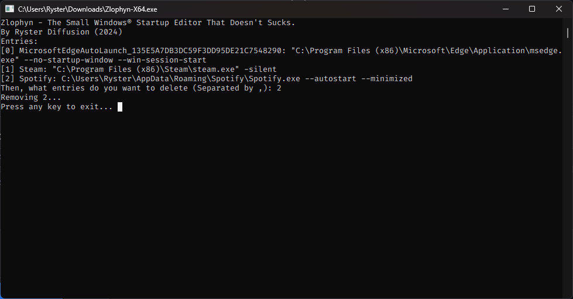

# Zlophyn
A simple program to erase your startup list written in less than 300 LOC of code in a single C++ file using Win32.

## Why you should this?
- you want
- you don't like GUI interfaces
- you don't want to install a program just to clean your startup list
- your taskmgr is blacklisted
- it simples
- just takes 44 KB of your disk.

## No photos?

